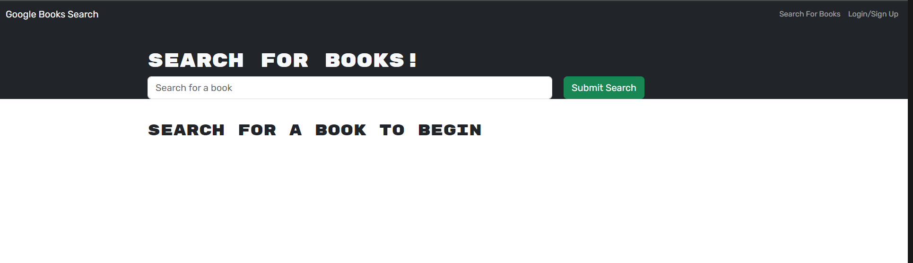

# Book-Search-Engine-Refactor

This is a book search engine that utilizes the Google Books API. It has been refactored from a RESTful API to be a GraphQL API built with the Apollo Server.

When you visit the website, you will be greeted by the homepage with a search bar and a login/signup link in the top right corner. You will be able to search for books, but in order to save books, you will need to be logged in.

When you click on the Login/Signup link, a modal pops up with inputs for your email and password.

When you click on the Sign Up button at the top of the modal, you will see inputs for a username, email, and password.

After you finish your signup, you will be brough back to the homepage. You will now notice a new link in the upper right hand corner that reads "See Your Books". This is where you can see books that you have saved.

When you search for a book in the search bar, results from that search will generate on the page.

If you click on the "Save this Book!" button, that book will be saved and you can view it through the "See Your Books" link.

If you click on the "Delete this Book!" button, that book will be removed from your saved books.

Deployed project: https://glacial-fjord-11033-825c4a54351a.herokuapp.com/
